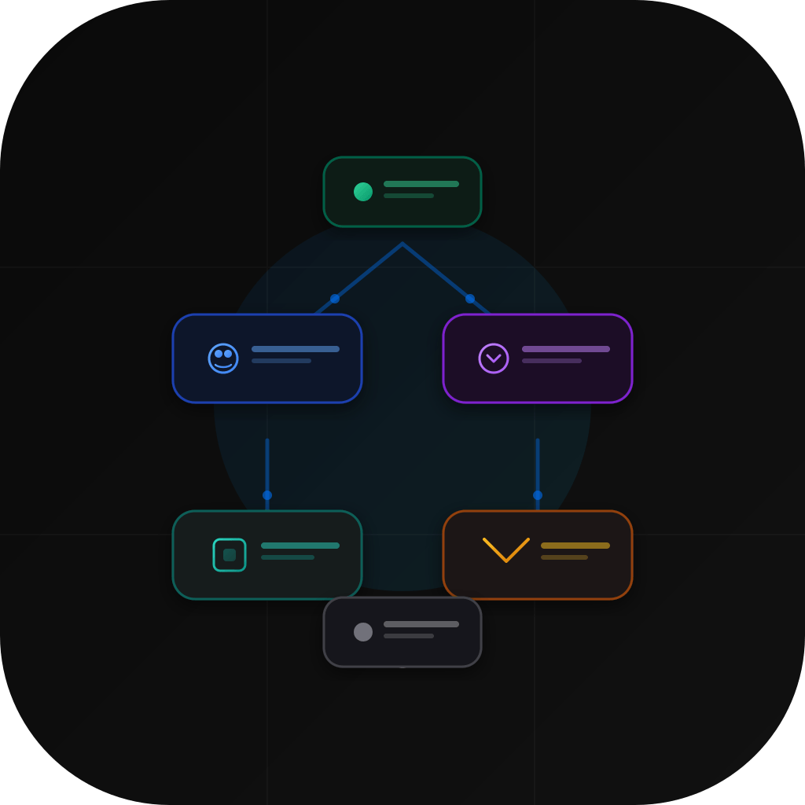
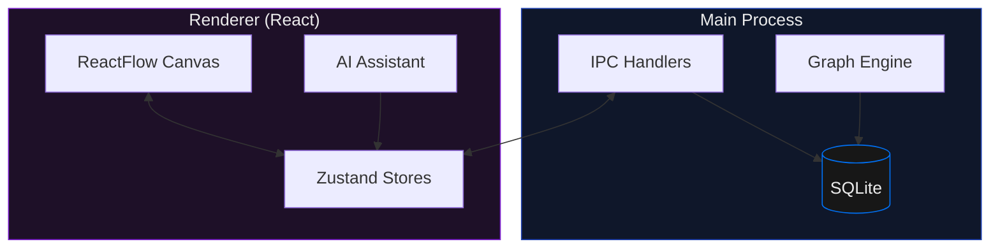
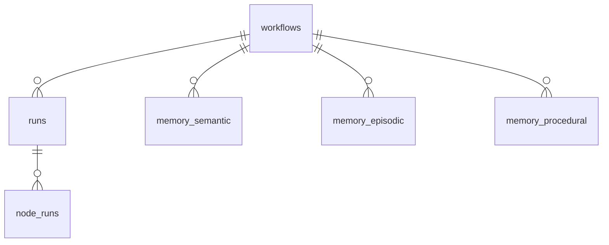

<p align="center">
  
</p>

<h1 align="center">Evoflux</h1>

<p align="center">
  AI-Powered Workflow Automation for Software Development
</p>

---

## What is Evoflux?

A desktop app for building AI-driven workflows visually. Drag-and-drop nodes on a canvas, connect them, configure AI providers, and run — with real-time monitoring and an AI assistant that builds workflows for you.

## Quick Start

```bash
git clone https://github.com/khuonghung/evoflux.git
cd evoflux
npm install
npx electron-rebuild -f -w better-sqlite3
npm run dev
```

## Features

| Feature | Description |
|---------|-------------|
| **Visual Canvas** | Drag-and-drop workflow builder with 21 node types |
| **Multi-Provider AI** | OpenAI, Anthropic, Ollama, OpenAI-Compatible, CLI tools |
| **AI Assistant** | Chat-based workflow creation using ReAct agent with 10 tools |
| **Real-Time Execution** | Node-level progress tracking with status indicators |
| **3-Tier Memory** | Semantic, Episodic, and Procedural memory across runs |
| **SQLite Storage** | All data persisted to `~/.evoflux/evoflux.db` |
| **Auto-Save** | 500ms debounced + synchronous save on app close |
| **Customizable** | Themes, accent colors, fonts, layout direction |

## Node Types

**Triggers:** Manual · Webhook · Schedule

**AI:** LLM · Parameter Extractor · Question Classifier · Knowledge Retrieval

**Logic:** Condition · Iteration · Loop · Template · Variable Aggregator · Variable Assigner

**Tools:** Code · Shell · HTTP Request · File Explorer · File Reader · File Write · Context Loader

**Agents:** ReAct Agent · Agent Orchestrator · Sub-Workflow

## AI Providers

Each node can use a different provider. Add multiple instances of the same type.

| Provider | Auth |
|----------|------|
| OpenAI | API Key |
| Anthropic | API Key |
| Ollama | Local |
| OpenAI-Compatible | API Key + URL |
| Claude CLI | CLI |
| Copilot CLI | GitHub |

## Build Installers

```bash
npm run build:mac    # macOS DMG (x64 + arm64)
npm run build:win    # Windows NSIS
npm run build:all    # Both
```

## Architecture





## Tech Stack

Electron · React · TypeScript · Vite · ReactFlow · Ant Design · Zustand · better-sqlite3 · Dagre · Monaco Editor

## License

MIT
