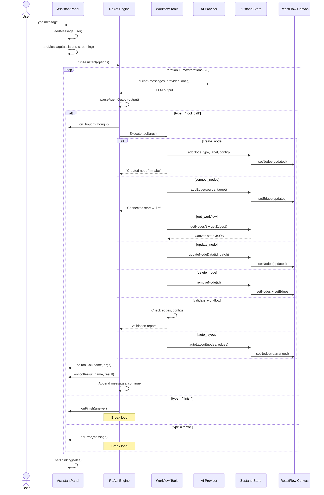

```mermaid
sequenceDiagram
    actor User
    participant Panel as AssistantPanel
    participant Engine as ReAct Engine
    participant Tools as Workflow Tools
    participant Provider as AI Provider
    participant Store as Zustand Store
    participant Canvas as ReactFlow Canvas

    User->>Panel: Type message
    Panel->>Panel: addMessage(user)
    Panel->>Panel: addMessage(assistant, streaming)
    Panel->>Engine: runAssistant(options)

    loop Iteration 1..maxIterations (20)
        Engine->>Provider: ai.chat(messages, providerConfig)
        Provider-->>Engine: LLM output
        Engine->>Engine: parseAgentOutput(output)

        alt type = "tool_call"
            Engine->>Panel: onThought(thought)
            Engine->>Tools: Execute tool(args)

            alt create_node
                Tools->>Store: addNode(type, label, config)
                Store->>Canvas: setNodes(updated)
                Tools-->>Engine: "Created node 'llm-abc'"
            else connect_nodes
                Tools->>Store: addEdge(source, target)
                Store->>Canvas: setEdges(updated)
                Tools-->>Engine: "Connected start → llm"
            else get_workflow
                Tools->>Store: getNodes() + getEdges()
                Store-->>Tools: Canvas state JSON
            else update_node
                Tools->>Store: updateNodeData(id, patch)
                Store->>Canvas: setNodes(updated)
            else delete_node
                Tools->>Store: removeNode(id)
                Store->>Canvas: setNodes + setEdges
            else validate_workflow
                Tools->>Tools: Check edges, configs
                Tools-->>Engine: Validation report
            else auto_layout
                Tools->>Store: autoLayout(nodes, edges)
                Store->>Canvas: setNodes(rearranged)
            end

            Engine->>Panel: onToolCall(name, args)
            Engine->>Panel: onToolResult(name, result)
            Engine->>Engine: Append messages, continue

        else type = "finish"
            Engine->>Panel: onFinish(answer)
            Note over Engine: Break loop

        else type = "error"
            Engine->>Panel: onError(message)
            Note over Engine: Break loop
        end
    end

    Panel->>Panel: setThinking(false)
```
