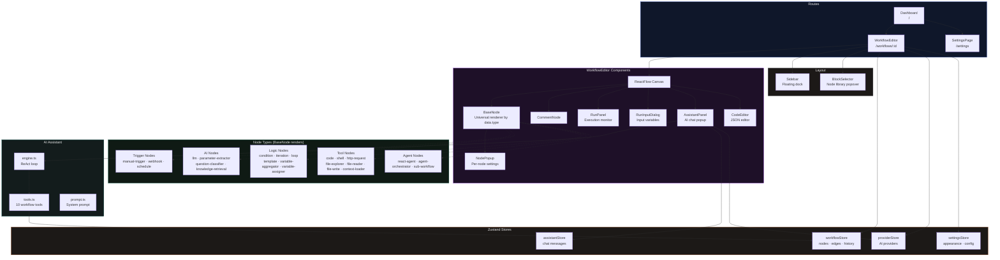

```mermaid
graph TB
    subgraph routes["Routes"]
        dash["Dashboard<br/>/"]
        editor["WorkflowEditor<br/>/workflows/:id"]
        settings["SettingsPage<br/>/settings"]
    end

    subgraph editorComponents["WorkflowEditor Components"]
        canvas["ReactFlow Canvas"]
        basenode["BaseNode<br/>Universal renderer by data.type"]
        comment["CommentNode"]
        popup["NodePopup<br/>Per-node settings"]
        runpanel["RunPanel<br/>Execution monitor"]
        rundialog["RunInputDialog<br/>Input variables"]
        assist["AssistantPanel<br/>AI chat popup"]
        code["CodeEditor<br/>JSON editor"]
    end

    subgraph layout["Layout"]
        dock["Sidebar<br/>Floating dock"]
        blocks["BlockSelector<br/>Node library popover"]
    end

    subgraph nodeTypes["Node Types (BaseNode renders)"]
        triggers["Trigger Nodes<br/>manual-trigger · webhook · schedule"]
        aiNodes["AI Nodes<br/>llm · parameter-extractor<br/>question-classifier · knowledge-retrieval"]
        logicNodes["Logic Nodes<br/>condition · iteration · loop<br/>template · variable-aggregator · variable-assigner"]
        toolNodes["Tool Nodes<br/>code · shell · http-request<br/>file-explorer · file-reader · file-write · context-loader"]
        agentNodes["Agent Nodes<br/>react-agent · agent-orchestrator · sub-workflow"]
    end

    subgraph aiAssistant["AI Assistant"]
        engine["engine.ts<br/>ReAct loop"]
        tools["tools.ts<br/>10 workflow tools"]
        prompt["prompt.ts<br/>System prompt"]
    end

    subgraph stores["Zustand Stores"]
        ws["workflowStore<br/>nodes · edges · history"]
        ps["providerStore<br/>AI providers"]
        ss["settingsStore<br/>appearance · config"]
        asst["assistantStore<br/>chat messages"]
    end

    dash --> editor
    dash --> settings
    editor --> canvas
    editor --> dock
    editor --> blocks

    canvas --> basenode
    canvas --> comment
    basenode --> popup
    canvas --> runpanel
    canvas --> rundialog
    canvas --> assist
    canvas --> code

    basenode -.-> triggers
    basenode -.-> aiNodes
    basenode -.-> logicNodes
    basenode -.-> toolNodes
    basenode -.-> agentNodes

    assist --> engine
    engine --> tools
    tools --> ws

    editor --> ws
    editor --> ps
    editor --> ss
    assist --> asst
    assist --> ps

    style routes fill:#0f172a,stroke:#1e40af,color:#ededed
    style editorComponents fill:#1e1028,stroke:#7e22ce,color:#ededed
    style layout fill:#1c1917,stroke:#3f3f46,color:#ededed
    style nodeTypes fill:#0f1a14,stroke:#065f46,color:#ededed
    style aiAssistant fill:#131c1c,stroke:#115e59,color:#ededed
    style stores fill:#1c1917,stroke:#92400e,color:#ededed
```
