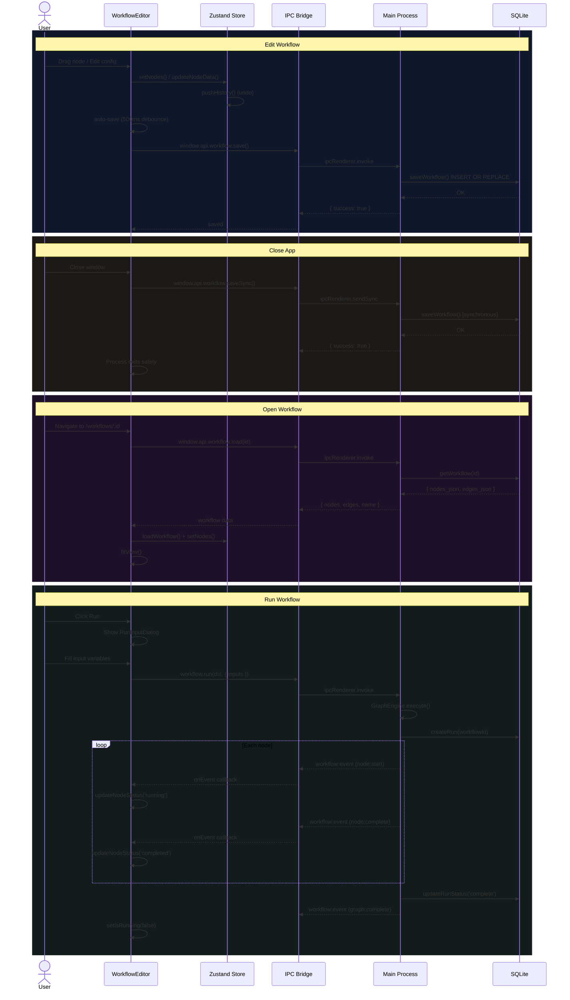

```mermaid
sequenceDiagram
    actor User
    participant Editor as WorkflowEditor
    participant Store as Zustand Store
    participant IPC as IPC Bridge
    participant Main as Main Process
    participant DB as SQLite

    rect rgb(15, 23, 42)
    Note over User,DB: Edit Workflow
    User->>Editor: Drag node / Edit config
    Editor->>Store: setNodes() / updateNodeData()
    Store->>Store: pushHistory() (undo)
    Editor->>Editor: auto-save (500ms debounce)
    Editor->>IPC: window.api.workflow.save()
    IPC->>Main: ipcRenderer.invoke
    Main->>DB: saveWorkflow() INSERT OR REPLACE
    DB-->>Main: OK
    Main-->>IPC: { success: true }
    IPC-->>Editor: saved
    end

    rect rgb(28, 25, 23)
    Note over User,DB: Close App
    User->>Editor: Close window
    Editor->>IPC: window.api.workflow.saveSync()
    IPC->>Main: ipcRenderer.sendSync
    Main->>DB: saveWorkflow() [synchronous]
    DB-->>Main: OK
    Main-->>IPC: { success: true }
    Editor->>Editor: Process exits safely
    end

    rect rgb(30, 16, 40)
    Note over User,DB: Open Workflow
    User->>Editor: Navigate to /workflows/:id
    Editor->>IPC: window.api.workflow.load(id)
    IPC->>Main: ipcRenderer.invoke
    Main->>DB: getWorkflow(id)
    DB-->>Main: { nodes_json, edges_json }
    Main-->>IPC: { nodes, edges, name }
    IPC-->>Editor: workflow data
    Editor->>Store: loadWorkflow() + setNodes()
    Editor->>Editor: fitView()
    end

    rect rgb(19, 28, 28)
    Note over User,DB: Run Workflow
    User->>Editor: Click Run
    Editor->>Editor: Show RunInputDialog
    User->>Editor: Fill input variables
    Editor->>IPC: workflow.run(dsl, { inputs })
    IPC->>Main: ipcRenderer.invoke
    Main->>Main: GraphEngine.execute()
    Main->>DB: createRun(workflowId)
    loop Each node
        Main-->>IPC: workflow:event (node:start)
        IPC-->>Editor: onEvent callback
        Editor->>Editor: updateNodeStatus('running')
        Main-->>IPC: workflow:event (node:complete)
        IPC-->>Editor: onEvent callback
        Editor->>Editor: updateNodeStatus('completed')
    end
    Main->>DB: updateRunStatus('complete')
    Main-->>IPC: workflow:event (graph:complete)
    Editor->>Editor: setIsRunning(false)
    end
```
