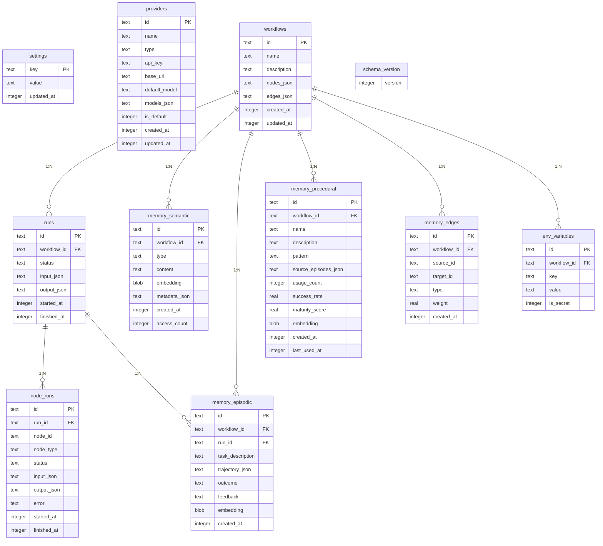

```mermaid
erDiagram
    settings {
        text key PK
        text value
        integer updated_at
    }

    providers {
        text id PK
        text name
        text type
        text api_key
        text base_url
        text default_model
        text models_json
        integer is_default
        integer created_at
        integer updated_at
    }

    workflows {
        text id PK
        text name
        text description
        text nodes_json
        text edges_json
        integer created_at
        integer updated_at
    }

    runs {
        text id PK
        text workflow_id FK
        text status
        text input_json
        text output_json
        integer started_at
        integer finished_at
    }

    node_runs {
        text id PK
        text run_id FK
        text node_id
        text node_type
        text status
        text input_json
        text output_json
        text error
        integer started_at
        integer finished_at
    }

    memory_semantic {
        text id PK
        text workflow_id FK
        text type
        text content
        blob embedding
        text metadata_json
        integer created_at
        integer access_count
    }

    memory_episodic {
        text id PK
        text workflow_id FK
        text run_id FK
        text task_description
        text trajectory_json
        text outcome
        text feedback
        blob embedding
        integer created_at
    }

    memory_procedural {
        text id PK
        text workflow_id FK
        text name
        text description
        text pattern
        text source_episodes_json
        integer usage_count
        real success_rate
        real maturity_score
        blob embedding
        integer created_at
        integer last_used_at
    }

    memory_edges {
        text id PK
        text workflow_id FK
        text source_id
        text target_id
        text type
        real weight
        integer created_at
    }

    env_variables {
        text id PK
        text workflow_id FK
        text key
        text value
        integer is_secret
    }

    schema_version {
        integer version
    }

    workflows ||--o{ runs : "1:N"
    runs ||--o{ node_runs : "1:N"
    workflows ||--o{ memory_semantic : "1:N"
    workflows ||--o{ memory_episodic : "1:N"
    workflows ||--o{ memory_procedural : "1:N"
    workflows ||--o{ memory_edges : "1:N"
    workflows ||--o{ env_variables : "1:N"
    runs ||--o{ memory_episodic : "1:N"
```
