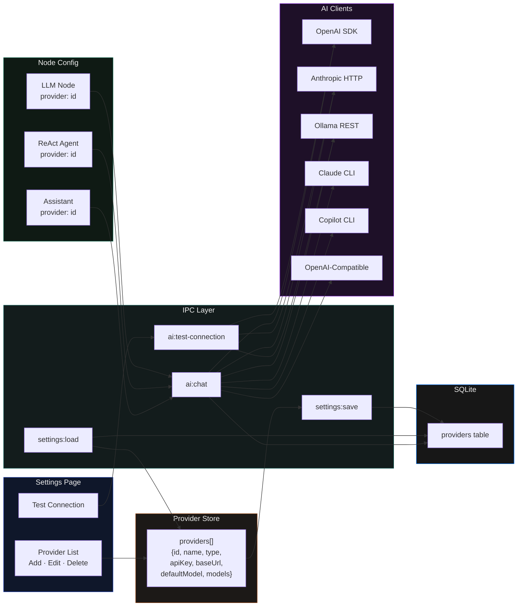

```mermaid
graph LR
    subgraph settings["Settings Page"]
        pl["Provider List<br/>Add · Edit · Delete"]
        tc["Test Connection"]
    end

    subgraph store["Provider Store"]
        ps["providers[]<br/>{id, name, type,<br/>apiKey, baseUrl,<br/>defaultModel, models}"]
    end

    subgraph db["SQLite"]
        pt["providers table"]
    end

    subgraph ipc["IPC Layer"]
        save["settings:save"]
        load["settings:load"]
        chat["ai:chat"]
        test["ai:test-connection"]
    end

    subgraph clients["AI Clients"]
        openai["OpenAI SDK"]
        anthropic["Anthropic HTTP"]
        ollama["Ollama REST"]
        claudecli["Claude CLI"]
        copilotcli["Copilot CLI"]
        oacompat["OpenAI-Compatible"]
    end

    subgraph nodes["Node Config"]
        llm["LLM Node<br/>provider: id"]
        react["ReAct Agent<br/>provider: id"]
        assist["Assistant<br/>provider: id"]
    end

    pl --> ps
    ps --> save
    save --> pt
    load --> pt
    load --> ps

    tc --> test
    test --> openai
    test --> anthropic
    test --> ollama

    llm --> chat
    react --> chat
    assist --> chat

    chat --> pt
    chat --> openai
    chat --> anthropic
    chat --> ollama
    chat --> claudecli
    chat --> copilotcli
    chat --> oacompat

    style settings fill:#0f172a,stroke:#1e40af,color:#ededed
    style store fill:#1c1917,stroke:#92400e,color:#ededed
    style db fill:#171717,stroke:#0070f3,color:#ededed
    style ipc fill:#131c1c,stroke:#115e59,color:#ededed
    style clients fill:#1e1028,stroke:#7e22ce,color:#ededed
    style nodes fill:#0f1a14,stroke:#065f46,color:#ededed
```
