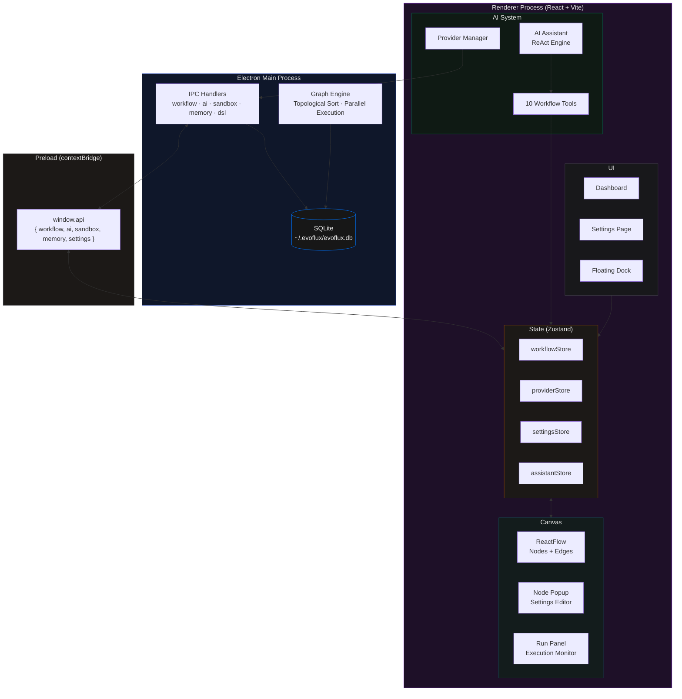

```mermaid
graph TB
    subgraph main["Electron Main Process"]
        ipc["IPC Handlers<br/>workflow · ai · sandbox · memory · dsl"]
        engine["Graph Engine<br/>Topological Sort · Parallel Execution"]
        db[("SQLite<br/>~/.evoflux/evoflux.db")]
    end

    subgraph preload["Preload (contextBridge)"]
        bridge["window.api<br/>{ workflow, ai, sandbox, memory, settings }"]
    end

    subgraph renderer["Renderer Process (React + Vite)"]
        subgraph canvas["Canvas"]
            rf["ReactFlow<br/>Nodes + Edges"]
            popup["Node Popup<br/>Settings Editor"]
            run["Run Panel<br/>Execution Monitor"]
        end

        subgraph ai["AI System"]
            assistant["AI Assistant<br/>ReAct Engine"]
            tools["10 Workflow Tools"]
            providers["Provider Manager"]
        end

        subgraph stores["State (Zustand)"]
            ws["workflowStore"]
            ps["providerStore"]
            ss["settingsStore"]
            as["assistantStore"]
        end

        subgraph ui["UI"]
            dash["Dashboard"]
            settings["Settings Page"]
            dock["Floating Dock"]
        end
    end

    ipc --> db
    engine --> db
    ipc <--> bridge
    bridge <--> stores
    stores <--> canvas
    assistant --> tools
    tools --> stores
    providers --> ipc
    ui --> stores

    style main fill:#0f172a,stroke:#1e40af,color:#ededed
    style preload fill:#1c1917,stroke:#3f3f46,color:#ededed
    style renderer fill:#1e1028,stroke:#7e22ce,color:#ededed
    style canvas fill:#131c1c,stroke:#115e59,color:#ededed
    style ai fill:#0f1a14,stroke:#065f46,color:#ededed
    style stores fill:#1c1917,stroke:#92400e,color:#ededed
    style ui fill:#18181b,stroke:#3f3f46,color:#ededed
    style db fill:#171717,stroke:#0070f3,color:#ededed
```
