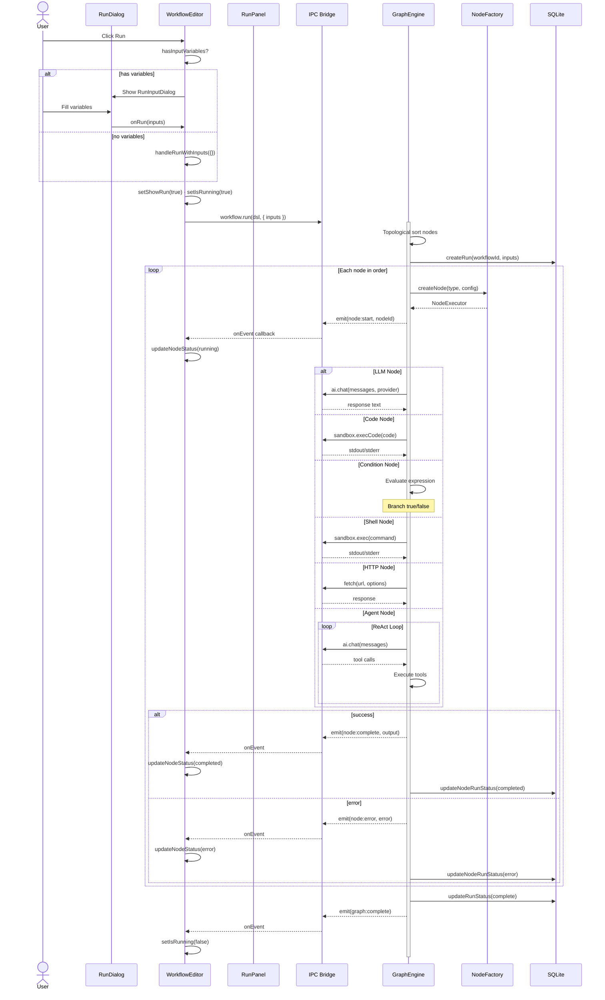

```mermaid
sequenceDiagram
    actor User
    participant Dialog as RunDialog
    participant Editor as WorkflowEditor
    participant Panel as RunPanel
    participant IPC as IPC Bridge
    participant Engine as GraphEngine
    participant Factory as NodeFactory
    participant DB as SQLite

    User->>Editor: Click Run
    Editor->>Editor: hasInputVariables?
    alt has variables
        Editor->>Dialog: Show RunInputDialog
        User->>Dialog: Fill variables
        Dialog->>Editor: onRun(inputs)
    else no variables
        Editor->>Editor: handleRunWithInputs({})
    end

    Editor->>Editor: setShowRun(true) · setIsRunning(true)
    Editor->>IPC: workflow.run(dsl, { inputs })
    activate Engine
    Engine->>Engine: Topological sort nodes
    Engine->>DB: createRun(workflowId, inputs)

    loop Each node in order
        Engine->>Factory: createNode(type, config)
        Factory-->>Engine: NodeExecutor

        Engine-->>IPC: emit(node:start, nodeId)
        IPC-->>Editor: onEvent callback
        Editor->>Editor: updateNodeStatus(running)

        alt LLM Node
            Engine->>IPC: ai.chat(messages, provider)
            IPC-->>Engine: response text
        else Code Node
            Engine->>IPC: sandbox.execCode(code)
            IPC-->>Engine: stdout/stderr
        else Condition Node
            Engine->>Engine: Evaluate expression
            Note over Engine: Branch true/false
        else Shell Node
            Engine->>IPC: sandbox.exec(command)
            IPC-->>Engine: stdout/stderr
        else HTTP Node
            Engine->>IPC: fetch(url, options)
            IPC-->>Engine: response
        else Agent Node
            loop ReAct Loop
                Engine->>IPC: ai.chat(messages)
                IPC-->>Engine: tool calls
                Engine->>Engine: Execute tools
            end
        end

        alt success
            Engine-->>IPC: emit(node:complete, output)
            IPC-->>Editor: onEvent
            Editor->>Editor: updateNodeStatus(completed)
            Engine->>DB: updateNodeRunStatus(completed)
        else error
            Engine-->>IPC: emit(node:error, error)
            IPC-->>Editor: onEvent
            Editor->>Editor: updateNodeStatus(error)
            Engine->>DB: updateNodeRunStatus(error)
        end
    end

    Engine->>DB: updateRunStatus(complete)
    Engine-->>IPC: emit(graph:complete)
    IPC-->>Editor: onEvent
    Editor->>Editor: setIsRunning(false)
    deactivate Engine
```
